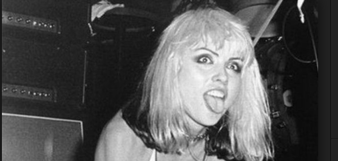

# HangmanPUNKBands

"Hangman" the computer game.  This Web Application will run in the browser and feature a dynamically updated HTML powered by JavaScript code.

* https://soniabradley.github.io/HangmanPUNKBands/

# Built With
* [Javascript](https://en.wikipedia.org/wiki/JavaScript)
* [Math.floor](https://www.google.com/search?q=math.floor+javascript&oq=math.floor&aqs=chrome.2.69i57j5j0l2j35i39j0.7469j0j4&sourceid=chrome&ie=UTF-8)
* [Math.random](https://www.google.com/search?q=math.random&oq=math.random&aqs=chrome..69i57j5j0l4.7118j0j9&sourceid=chrome&ie=UTF-8)
* [.keycode](http://keycode.info/)

# Author
Sonia Bradley

# License
This project is licensed under the MIT License

# Acknowledgments
Thank you [Duy Do]() for helping me find the extra semi-colon that I could not see for weeks.

# To Do
Add Style and make the last letter show up too.